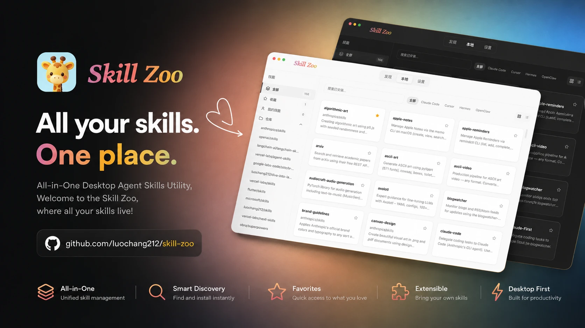

<div align="right">
  <a title="English" href="README.md"></a>
  <a title="简体中文" href="README_zh-CN.md"></a>
</div>

# Skill Zoo



Local Agent Skills Manager — Discover, install, and manage skills for AI coding tools including Claude Code, Codex, Cursor, Gemini and more.

## 🚀 Features

- **Browse & Discover**: Explore skill repositories on GitHub and [skills.sh](https://skills.sh/)
- **One-click Install**: Batch-install skills from GitHub repositories and symlink to target agents
- **Skill Authoring**: Built-in Markdown editor for editing skill files
- **Consistency Check**: Same-name skill detection, file format validation, and one-click deduplication for skills with identical name and hash
- **Multi-Agent Support**: Supports Claude Code, Cursor, Codex, and other AI coding assistants
- **Dark/Light Theme**: Follows system preference by default, with manual toggle
- **Multilingual**: English and Simplified Chinese

## ✨ Tech Stack

| Layer | Technology |
|-------|-----------|
| Frontend | React 19 + TypeScript 6 + Vite 8 |
| Backend | Rust (Tauri v2) |
| Styling | Tailwind CSS 4 + shadcn/ui |
| State | TanStack React Query |
| Animation | Framer Motion |
| i18n | i18next |
| Editor | CodeMirror 6 |
| Package Manager | Bun |

## 📦 Installation

### 1. macOS

Homebrew is recommended:

```bash
brew tap luochang212/tap
brew install --cask skill-zoo
```

You can also download the `.dmg` package from the [Releases](https://github.com/luochang212/skill-zoo/releases) page.

> If you see "skill-zoo" is damaged and can't be opened, run `xattr -d com.apple.quarantine /Applications/skill-zoo.app` in Terminal.

### 2. Windows

Download the `.msi` or `.exe` installer from the [Releases](https://github.com/luochang212/skill-zoo/releases) page.

## 🔧 Development

```bash
# Install dependencies
bun install

# Run in development mode
bun run tauri dev

# Type checking
bun run typecheck

# Build for production
bun run tauri build
```

## 📁 Project Structure

```
skill-zoo/
├── src/                    # React frontend
│   ├── components/
│   │   ├── skills/         # Skill browsing, detail, install, creation
│   │   ├── settings/       # Theme, language, maintenance, about
│   │   ├── layout/         # Top navigation
│   │   └── ui/             # shadcn/ui primitives
│   ├── hooks/              # React Query hooks & cache invalidation
│   ├── i18n/               # Translations (English, Chinese)
│   ├── lib/                # Tauri API client, agent config, platform utils
│   └── types/              # TypeScript type definitions
├── src-tauri/              # Tauri + Rust backend
│   ├── src/
│   │   ├── commands/       # Tauri IPC command handlers
│   │   ├── services/       # Skill operations, CLI management, lock file
│   │   ├── persistence/    # Metadata & settings persistence
│   │   ├── config.rs       # Agent config & path detection
│   │   ├── store.rs        # App state
│   │   └── error.rs        # Error types
│   ├── resources/          # Carousel banners, recommended repos
│   ├── Cargo.toml
│   └── tauri.conf.json
├── docs/                   # Screenshots
├── package.json
└── vite.config.ts
```

## 📜 License

[MIT](LICENSE)
