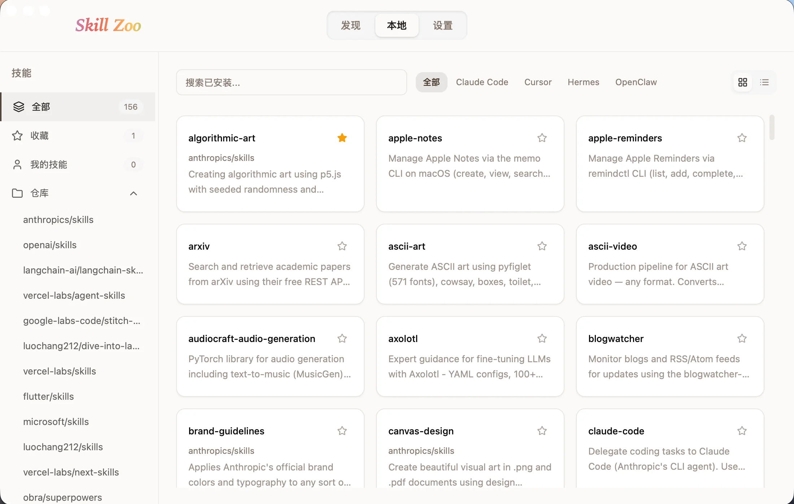

<div align="right">
  <a title="English" href="README.md"></a>
  <a title="简体中文" href="README_zh-CN.md"></a>
</div>

# Skill Zoo

Local AI Agent skill manager — browse, install, and manage skills for Claude Code, Codex, Cursor, Gemini, and more.



## Features

- **Browse & Discover** — Explore skill repositories on GitHub with banner carousel and recommended repos
- **One-click Install** — Install skills to a shared directory (`~/.agents/skills/`) and symlink to target agents
- **Skill Detail** — View, edit, and browse skill files with built-in Markdown editor and file tree
- **Skill Creation** — Create new skills and deploy to selected agents
- **Duplicate Detection** — Find skills with the same name across directories and merge them
- **Multi-Agent Support** — Claude Code, Codex, Gemini, Cursor, Trae, Trae CN, Hermes, OpenClaw
- **Dark/Light Theme** — Follows system preference by default, with manual toggle
- **Multilingual** — English and Simplified Chinese

## Tech Stack

| Layer | Technology |
|-------|-----------|
| Frontend | React 19 + TypeScript + Vite 8 |
| Backend | Rust (Tauri v2) |
| Styling | Tailwind CSS 4 + shadcn/ui |
| State | TanStack React Query |
| Animation | Framer Motion |
| i18n | i18next |
| Editor | CodeMirror 6 |
| Package Manager | Bun |

## Installation

### GitHub Releases

Download the latest version from the [Releases](https://github.com/luochang212/skill-zoo/releases) page:

- **macOS** — `.dmg` (Apple Silicon / Intel)
- **Windows** — `.msi` or `.exe`

> macOS users: if you see "app is damaged and can't be opened," run `xattr -d com.apple.quarantine /Applications/skill-zoo.app` in Terminal.

### Homebrew

```bash
brew tap luochang212/skill-zoo
brew install skill-zoo
```

## Development

Prerequisites: [Bun](https://bun.sh), [Rust](https://www.rust-lang.org/tools/install) (1.85+)

```bash
# Install dependencies
bun install

# Run in development mode
bun run tauri dev

# Type checking
bun run typecheck

# Build for production
bun run tauri build
```

## Project Structure

```
skill-zoo/
├── src/                    # React frontend
│   ├── components/
│   │   ├── skills/         # Skill browsing, detail, install, creation
│   │   ├── settings/       # Theme, language, maintenance, about
│   │   ├── layout/         # Header
│   │   └── ui/             # shadcn/ui primitives
│   ├── hooks/              # React Query hooks & query invalidation
│   ├── i18n/               # Translations (en, zh)
│   ├── lib/                # Tauri API clients, agent configs, platform utils
│   └── types/              # TypeScript type definitions
├── src-tauri/              # Tauri + Rust backend
│   ├── src/
│   │   ├── commands/       # Tauri IPC command handlers
│   │   ├── services/       # Skill ops, CLI add/remove, lock file
│   │   ├── persistence/    # Metadata & settings persistence
│   │   ├── config.rs       # Agent configs & path detection
│   │   ├── store.rs        # App state
│   │   └── error.rs        # Error types
│   ├── resources/          # Banners, recommended repos
│   ├── Cargo.toml
│   └── tauri.conf.json
├── docs/                   # Screenshots
├── package.json
└── vite.config.ts
```

## License

[MIT](LICENSE)
