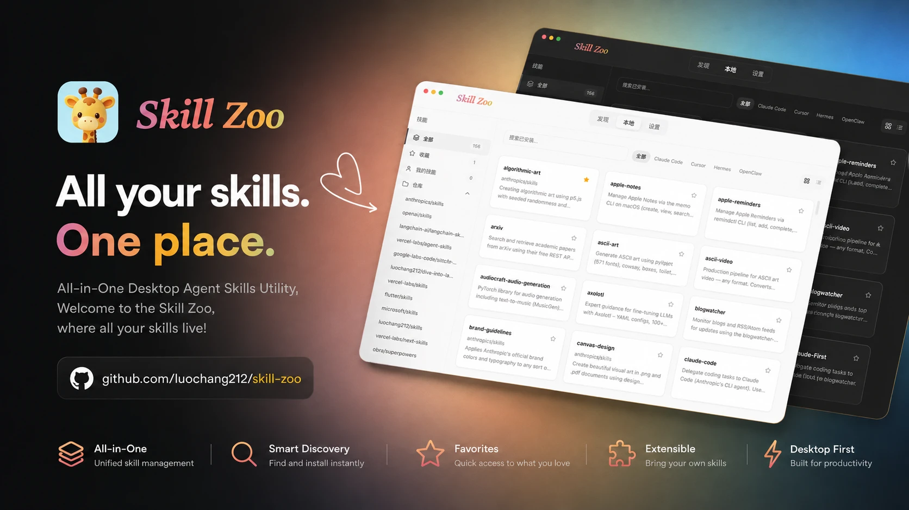

<div align="right">
  <a title="English" href="README.md"></a>
  <a title="简体中文" href="README_zh-CN.md"></a>
</div>

# Skill Zoo

[](https://github.com/luochang212/skill-zoo/releases)
[](https://github.com/luochang212/skill-zoo/releases)
[]()
[](LICENSE)
[![zread](https://img.shields.io/badge/%E2%80%8B-zread-0e7490?style=flat-square&logo=data%3Aimage%2Fsvg%2Bxml%3Bbase64%2CPHN2ZyB3aWR0aD0iMTYiIGhlaWdodD0iMTYiIHZpZXdCb3g9IjAgMCAxNiAxNiIgZmlsbD0ibm9uZSIgeG1sbnM9Imh0dHA6Ly93d3cudzMub3JnLzIwMDAvc3ZnIj4KPHBhdGggZD0iTTQuOTYxNTYgMS42MDAxSDIuMjQxNTZDMS44ODgxIDEuNjAwMSAxLjYwMTU2IDEuODg2NjQgMS42MDE1NiAyLjI0MDFWNC45NjAxQzEuNjAxNTYgNS4zMTM1NiAxLjg4ODEgNS42MDAxIDIuMjQxNTYgNS42MDAxSDQuOTYxNTZDNS4zMTUwMiA1LjYwMDEgNS42MDE1NiA1LjMxMzU2IDUuNjAxNTYgNC45NjAxVjIuMjQwMUM1LjYwMTU2IDEuODg2NjQgNS4zMTUwMiAxLjYwMDEgNC45NjE1NiAxLjYwMDFaIiBmaWxsPSIjZmZmIi8%2BCjxwYXRoIGQ9Ik00Ljk2MTU2IDEwLjM5OTlIMi4yNDE1NkMxLjg4ODEgMTAuMzk5OSAxLjYwMTU2IDEwLjY4NjQgMS42MDE1NiAxMS4wMzk5VjEzLjc1OTlDMS42MDE1NiAxNC4xMTM0IDEuODg4MSAxNC4zOTk5IDIuMjQxNTYgMTQuMzk5OUg0Ljk2MTU2QzUuMzE1MDIgMTQuMzk5OSA1LjYwMTU2IDE0LjExMzQgNS42MDE1NiAxMy43NTk5VjExLjAzOTlDNS42MDE1NiAxMC42ODY0IDUuMzE1MDIgMTAuMzk5OSA0Ljk2MTU2IDEwLjM5OTlaIiBmaWxsPSIjZmZmIi8%2BCjxwYXRoIGQ9Ik0xMy43NTg0IDEuNjAwMUgxMS4wMzg0QzEwLjY4NSAxLjYwMDEgMTAuMzk4NCAxLjg4NjY0IDEwLjM5ODQgMi4yNDAxVjQuOTYwMUMxMC4zOTg0IDUuMzEzNTYgMTAuNjg1IDUuNjAwMSAxMS4wMzg0IDUuNjAwMUgxMy43NTg0QzE0LjExMTkgNS42MDAxIDE0LjM5ODQgNS4zMTM1NiAxNC4zOTg0IDQuOTYwMVYyLjI0MDFDMTQuMzk4NCAxLjg4NjY0IDE0LjExMTkgMS42MDAxIDEzLjc1ODQgMS42MDAxWiIgZmlsbD0iI2ZmZiIvPgo8cGF0aCBkPSJNNCAxMkwxMiA0TDQgMTJaIiBmaWxsPSIjZmZmIi8%2BCjxwYXRoIGQ9Ik00IDEyTDEyIDQiIHN0cm9rZT0iI2ZmZiIgc3Ryb2tlLXdpZHRoPSIxLjUiIHN0cm9rZS1saW5lY2FwPSJyb3VuZCIvPgo8L3N2Zz4K&logoColor=ffffff)](https://zread.ai/luochang212/skill-zoo)
[](https://github.com/luochang212/skill-zoo/actions)




Local Agent Skills Manager: Discover, install, and manage skills for AI coding tools including Claude Code, Codex, Gemini, OpenCode, Cursor, Trae, Hermes, OpenClaw and more.

## ✨ Tech Stack

| Layer | Technology |
|-------|-----------|
| Frontend | React 19 + TypeScript 6 + Vite 8 |
| Backend | Rust (Tauri v2) |
| Styling | Tailwind CSS 4 + shadcn/ui |
| State | TanStack React Query |
| Animation | Framer Motion |
| i18n | i18next |
| Lint | oxlint + clippy |
| Format | oxfmt + cargo fmt |
| Testing | Vitest + Rust tests |
| Package Manager | Bun |

## 🚀 Features

- **Explore & Install**: Search and download skills from GitHub repositories
- **Update Skills**: Update installed skills to the latest version from GitHub
- **Skill Authoring**: Built-in Markdown editor to create skills anywhere, anytime
- **Batch Operations**: Install, delete, or merge duplicate skills in bulk
- **Security Audit**: View community audit scores from skills.sh
- **Consistency Check**: Proactively detect three types of inconsistencies and prompt fixes
- **Skill Archive**: Move skills into the archive as temporary storage to reduce context load
- **CLI + WUI**: Provide Skill Zoo control surfaces for Coding Agents and humans

## 🙌 CLI

When you want to manage Skill Zoo from a coding agent, terminal, or automation, install the npm CLI:

```bash
npm i -g skill-zoo
skill-zoo --help

skill-zoo list           # List installed skills
skill-zoo doctor --fix   # Diagnose and fix common issues
skill-zoo wui            # Start the local Web UI
```

See: [Skill Zoo CLI](https://www.npmjs.com/package/skill-zoo)

## 📦 Installation

Download the latest build from [Releases](https://github.com/luochang212/skill-zoo/releases).

### macOS

1. Download the `.dmg`.
2. Open it and drag `skill-zoo.app` into `Applications`.

### Windows

1. Download the `.exe` installer.
2. Run it. The installer creates shortcuts and supports automatic updates.

**Note:** If SmartScreen shows a warning, click **"More info"** and then **"Run anyway"**.

### Linux

Download the AppImage for your CPU architecture, then run:

```bash
chmod +x Skill-Zoo-*-Linux-*.AppImage
./Skill-Zoo-*-Linux-*.AppImage
```

## 😇 Trust & Security

- **Auditable Code**: 100% open source. Every build runs on GitHub Actions for anyone to inspect.
- **Connects On Demand**: No background polling. Network only fires on browse or install.
- **You Stay in Control**: Any operation that touches real files (delete, move, overwrite) asks for confirmation first.

## 💡 Contributing

For development, see [docs/development.md](docs/development.md).

Found a bug or have an idea? Open an [issue](https://github.com/luochang212/skill-zoo/issues) or submit a PR. Contributions of all kinds are welcome!

## 📜 License

[MIT](LICENSE)
