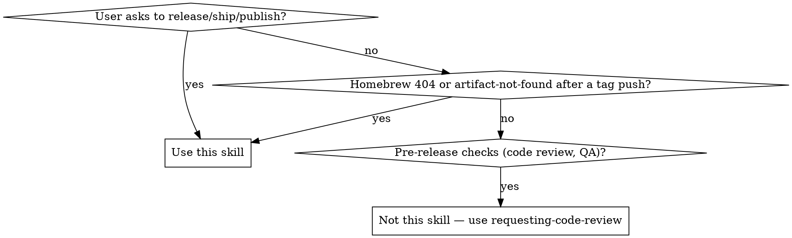

# Release

## Overview

Release is done by pushing a `v*` tag. CI builds all platforms, creates a GitHub Release, and updates the Homebrew cask. Manual steps: update CHANGELOG.md, then tag and push.

**Announce at start:** "I'm using the release skill to ship a new version."

## When to Use



**Use when:**
- User says "release", "ship", "publish", "new version", "bump version"
- Homebrew cask update failed (404 on DMG URLs)
- CI `create-release` job failed to find artifacts

**Don't use for:**
- Code review before releasing
- Deciding WHAT version number (ask the user)
- Feature work or bug fixes

## Quick Reference

| Step | Command |
|------|---------|
| Check existing tags | `git tag --sort=-v:refname \| head -5` |
| Prerequisites (in order) | fmt → lint:rs → test → typecheck → lint → format:check → status |
| Check Rust formatting | `cargo fmt --check --manifest-path src-tauri/Cargo.toml` |
| Check Rust lint | `bun run lint:rs` |
| Check TypeScript types | `bun run typecheck` |
| Check frontend lint | `bun run lint` |
| Check frontend formatting | `bun run format:check` |
| Check uncommitted changes | `git status --short` |
| Verify cask URL | `gh api repos/luochang212/homebrew-tap/contents/Casks/skill-zoo.rb --jq '.content' \| base64 -d` |
| Tag and push | `git push origin main && git tag v<VERSION> && git push origin v<VERSION>` |
| Monitor CI | https://github.com/luochang212/skill-zoo/actions |

## Core Pattern

### 1. Confirm Version

Ask the user. Check `git tag --sort=-v:refname | head -5` for context. Version must start with `v` (only `v*` tags trigger CI).

### 2. Update CHANGELOG.md

Add a new version section before the previous release entry:

```markdown
## [X.Y.Z] — YYYY-MM-DD
```

Use today's date. Group changes under **Added**, **Changed**, **Fixed** headings. Review commits since the last tag with `git log --oneline v<LAST>..HEAD` to ensure nothing is missed.

Commit the changelog update before proceeding.

### 3. Update Version Files

Update `src-tauri/Cargo.toml` and `docs/version.json` to match the release version:

```bash
sed -i '' 's/^version = ".*"/version = "X.Y.Z"/' src-tauri/Cargo.toml
cargo check --manifest-path src-tauri/Cargo.toml  # regenerates Cargo.lock
echo '{"version":"vX.Y.Z"}' > docs/version.json
```

Commit Cargo.toml, Cargo.lock, and version.json together before proceeding.

### 4. Verify Cask URL Pattern

Before tagging, verify the Homebrew cask URL pattern matches the CI artifact naming:

```bash
gh api repos/luochang212/homebrew-tap/contents/Casks/skill-zoo.rb --jq '.content' | base64 -d
```

Check that the URL in the cask matches the artifact naming produced by CI:
```
Skill-Zoo-v{VERSION}-macOS.dmg
```

A mismatched URL will 404 for all Homebrew users. If the pattern doesn't match, fix the cask formula before proceeding.

### 5. Verify Prerequisites

Run all checks in order. If any fails, fix and re-run the full sequence until clean — formatting changes can cascade into lint results.

1. `cargo fmt --check --manifest-path src-tauri/Cargo.toml` — run `cargo fmt --manifest-path src-tauri/Cargo.toml` if diffs appear, then restart from here
2. `bun run lint:rs` — fix all warnings; fmt may have introduced new ones
3. `cargo test --manifest-path src-tauri/Cargo.toml --features test-helpers` — fix any test failures before proceeding
4. `bun run typecheck` — fix all type errors before proceeding
5. `bun run lint` — fix any lint errors. Note: pre-existing issues unrelated to this release should be noted separately, not silently fixed in the release commit
6. `bun run format:check` — run `bun run format` if diffs appear. CI also enforces this, but catching it locally avoids a broken tag
7. `git status --short` is clean after all fixes are committed
8. `RELEASE_BODY.md` uses `__VERSION__` and `__COMMITS__` placeholders — never hardcoded version numbers

### 6. Tag and Push

> **CRITICAL:** Pushing a `v*` tag triggers CI to build and publish a release. **Always tell the user explicitly that a push is about to happen and get their consent before executing.** Never push without approval.

```bash
git push origin main
git tag v0.1.2
git push origin v0.1.2
```

### 7. CI Jobs (triggered by `v*` tag)

| Job | Outcome |
|---|---|
| **build** | Universal DMG, NSIS installer, portable zip → renamed to `Skill-Zoo-v{VERSION}-{platform}.{ext}` |
| **create-release** | GitHub Release with substituted release notes + all artifacts |
| **update-homebrew** | Computes SHA256, updates cask formula, opens PR |

### 8. Post-Release

- CI creates a PR in `luochang212/homebrew-tap` — once the PR looks good, merge it with `gh`:
  ```bash
  gh pr merge --squash --repo luochang212/homebrew-tap skill-zoo-<version>
  ```
- Verify the [GitHub Release](https://github.com/luochang212/skill-zoo/releases) shows correct assets and notes

## Common Mistakes

| Mistake | Fix |
|---------|-----|
| Pushing tag before pushing main | Always `git push origin main` first. A tag on an unpushed commit won't trigger CI on the right SHA. |
| Hardcoding version in RELEASE_BODY.md | Use `__VERSION__` placeholder. The CI substitutes it automatically. |
| Forgetting to check cask URL before releasing | Run the `gh api` command in Quick Reference. CI won't fix a broken URL pattern. |
| Releasing with uncommitted changes | `git status --short` must be empty. Uncommitted changes won't be included in the release. |
| Letting CI update `docs/version.json` | `version.json` is updated in Step 3 **before** tagging. CI must NOT touch it — the step was removed from the workflow. |
| Forgetting to regenerate `Cargo.lock` | After editing `Cargo.toml` version, run `cargo check --manifest-path src-tauri/Cargo.toml` to sync Cargo.lock. `sed` alone won't update it. |
