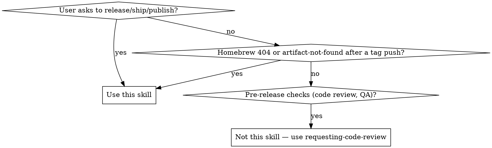

# Release

## Overview

Release is done by pushing a `v*` tag. CI builds all platforms, creates a GitHub Release, and updates the Homebrew cask. Manual steps: update CHANGELOG.md, then tag and push.

**Announce at start:** "I'm using the release skill to ship a new version."

## When to Use



**Use when:**
- User says "release", "ship", "publish", "new version", "bump version"
- Homebrew cask update failed (404 on DMG URLs)
- CI `create-release` job failed to find artifacts

**Don't use for:**
- Code review before releasing
- Deciding WHAT version number (ask the user)
- Feature work or bug fixes

## Quick Reference

| Step | Command |
|------|---------|
| Check existing tags | `git tag --sort=-v:refname \| head -5` |
| Prerequisites (in order) | fmt → lint:rs → test → typecheck → lint → format:check → status |
| Check Rust formatting | `cargo fmt --check --manifest-path src-tauri/Cargo.toml` |
| Check Rust lint | `bun run lint:rs` |
| Check TypeScript types | `bun run typecheck` |
| Check frontend lint | `bun run lint` |
| Check frontend formatting | `bun run format:check` |
| Check uncommitted changes | `git status --short` |
| Tag and push | `git push origin main && git tag v<VERSION> && git push origin v<VERSION>` |

## Core Pattern

All file changes (CHANGELOG, Cargo.toml, Cargo.lock, version.json) are made and committed together in a single commit. Do not commit after each step.

### 1. Confirm Version

Ask the user. Check `git tag --sort=-v:refname | head -5` for context. Version must start with `v` (only `v*` tags trigger CI).

### 2. Update CHANGELOG.md

Add a new version section before the previous release entry:

```markdown
## [X.Y.Z] — YYYY-MM-DD
```

Use today's date. Group changes under **Added**, **Changed**, **Fixed** headings. Review commits since the last tag with `git log --oneline v<LAST>..HEAD` to ensure nothing is missed.

Do NOT commit yet — all changes go into one commit in Step 4.

### 3. Update Version Files

Update `src-tauri/Cargo.toml` and `docs/version.json` to match the release version:

```bash
sed -i '' 's/^version = ".*"/version = "X.Y.Z"/' src-tauri/Cargo.toml
cargo check --manifest-path src-tauri/Cargo.toml  # regenerates Cargo.lock
echo '{"version":"vX.Y.Z"}' > docs/version.json
```

Do NOT commit yet — all changes go into one commit in Step 4.

### 4. Verify Prerequisites

Run all checks in order. If any fails, fix and re-run the full sequence until clean — formatting changes can cascade into lint results. Any fixes become part of the same release commit.

1. `cargo fmt --check --manifest-path src-tauri/Cargo.toml` — run `cargo fmt --manifest-path src-tauri/Cargo.toml` if diffs appear, then restart from here
2. `bun run lint:rs` — fix all warnings; fmt may have introduced new ones
3. `cargo test --manifest-path src-tauri/Cargo.toml --features test-helpers` — fix any test failures before proceeding
4. `bun run typecheck` — fix all type errors before proceeding
5. `bun run lint` — fix any lint errors. Note: pre-existing issues unrelated to this release should be noted separately, not silently fixed in the release commit
6. `bun run format:check` — run `bun run format` if diffs appear. CI also enforces this, but catching it locally avoids a broken tag
7. `RELEASE_BODY.md` uses `__VERSION__` and `__COMMITS__` placeholders — never hardcoded version numbers
8. `git status --short` — only expected files (CHANGELOG.md, Cargo.toml, Cargo.lock, docs/version.json, plus any fmt/clippy fixes) should appear. Anything else is a stray change that could slip into the release commit.

When all checks pass, commit everything in a single commit:

```bash
git add CHANGELOG.md src-tauri/Cargo.toml src-tauri/Cargo.lock docs/version.json
# also add any files modified by fmt/clippy fixes above
git commit -m "chore: release vX.Y.Z"
```

### 5. Tag and Push

> **CRITICAL:** Pushing a `v*` tag triggers CI to build and publish a release. **Always tell the user explicitly that a push is about to happen and get their consent before executing.** Never push without approval.

```bash
git push origin main
git tag v0.1.2
git push origin v0.1.2
```

### 6. CI Jobs (triggered by `v*` tag)

| Job | Outcome |
|---|---|
| **build** | Universal DMG, NSIS installer, portable zip → renamed to `Skill-Zoo-v{VERSION}-{platform}.{ext}` |
| **create-release** | GitHub Release with substituted release notes + all artifacts |
| **update-homebrew** | Computes SHA256, updates cask formula, opens PR, and auto-merges |

No manual monitoring or post-release steps needed — CI handles everything after the tag push.

## Common Mistakes

| Mistake | Fix |
|---------|-----|
| Pushing tag before pushing main | Always `git push origin main` first. A tag on an unpushed commit won't trigger CI on the right SHA. |
| Hardcoding version in RELEASE_BODY.md | Use `__VERSION__` placeholder. The CI substitutes it automatically. |
| Releasing with uncommitted changes | `git status --short` must be empty. Uncommitted changes won't be included in the release. |
| Letting CI update `docs/version.json` | `version.json` is updated in Step 3 **before** tagging. CI must NOT touch it — the step was removed from the workflow. |
| Forgetting to regenerate `Cargo.lock` | After editing `Cargo.toml` version, run `cargo check --manifest-path src-tauri/Cargo.toml` to sync Cargo.lock. `sed` alone won't update it. |
| Making multiple commits | All version updates (CHANGELOG, Cargo.toml, Cargo.lock, version.json) go into a single `chore: release vX.Y.Z` commit. Do not commit after each file. |
