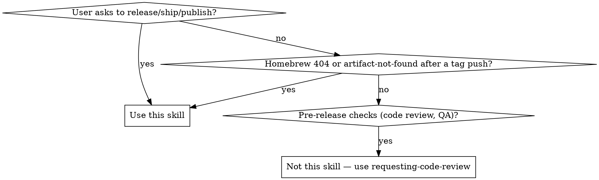

# Release

## Overview

Release is done by pushing a `v*` tag. CI builds all platforms, creates a GitHub Release, and updates the Homebrew cask. The only manual step is the tag push.

**Announce at start:** "I'm using the release skill to ship a new version."

## When to Use



**Use when:**
- User says "release", "ship", "publish", "new version", "bump version"
- Homebrew cask update failed (404 on DMG URLs)
- CI `create-release` job failed to find artifacts

**Don't use for:**
- Code review before releasing
- Deciding WHAT version number (ask the user)
- Feature work or bug fixes

## Quick Reference

| Step | Command |
|------|---------|
| Check existing tags | `git tag --sort=-v:refname \| head -5` |
| Check uncommitted changes | `git status --short` |
| Verify cask URL | `gh api repos/luochang212/homebrew-tap/contents/Casks/skill-zoo.rb --jq '.content' \| base64 -d` |
| Tag and push | `git push origin main && git tag v<VERSION> && git push origin v<VERSION>` |
| Monitor CI | https://github.com/luochang212/skill-zoo/actions |

## Core Pattern

### 1. Confirm Version

Ask the user. Check `git tag --sort=-v:refname | head -5` for context. Version must start with `v` (only `v*` tags trigger CI).

### 2. Verify Prerequisites

- `git status --short` is clean. Warn user if uncommitted changes exist.
- `RELEASE_BODY.md` uses `__VERSION__` and `__COMMITS__` placeholders — never hardcoded version numbers.
- The Homebrew cask URL pattern matches renamed artifacts:

```ruby
url ".../Skill-Zoo-v#{version}-macOS-arm64.dmg"
url ".../Skill-Zoo-v#{version}-macOS-x64.dmg"
```

CI only updates `version` and `sha256` in the formula. A mismatched URL 404s for all Homebrew users. Verify with the command in Quick Reference.

### 3. Tag and Push

```bash
git push origin main
git tag v0.1.2
git push origin v0.1.2
```

### 4. CI Jobs (triggered by `v*` tag)

| Job | Outcome |
|---|---|
| **build** | DMGs, NSIS installer, portable zip → renamed to `Skill-Zoo-v{VERSION}-{platform}.{ext}` |
| **create-release** | GitHub Release with substituted release notes + all artifacts |
| **update-homebrew** | Computes SHA256, updates cask formula, opens PR |

### 5. Post-Release

- Merge the auto-generated PR in `luochang212/homebrew-tap`
- Verify the [GitHub Release](https://github.com/luochang212/skill-zoo/releases) shows correct assets and notes

## Common Mistakes

| Mistake | Fix |
|---------|-----|
| Pushing tag before pushing main | Always `git push origin main` first. A tag on an unpushed commit won't trigger CI on the right SHA. |
| Hardcoding version in RELEASE_BODY.md | Use `__VERSION__` placeholder. The CI substitutes it automatically. |
| Forgetting to check cask URL before releasing | Run the `gh api` command in Quick Reference. CI won't fix a broken URL pattern. |
| Releasing with uncommitted changes | `git status --short` must be empty. Uncommitted changes won't be included in the release. |
